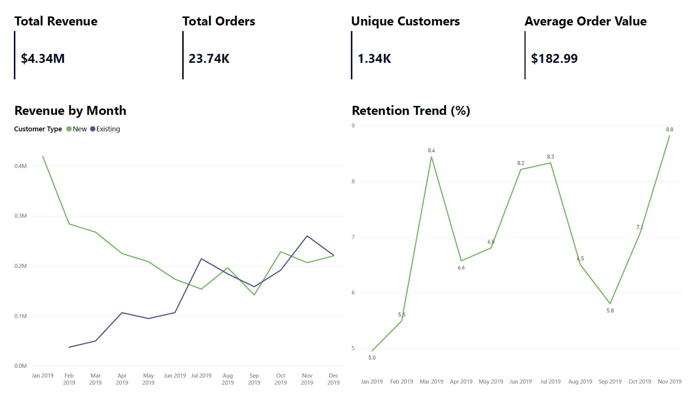
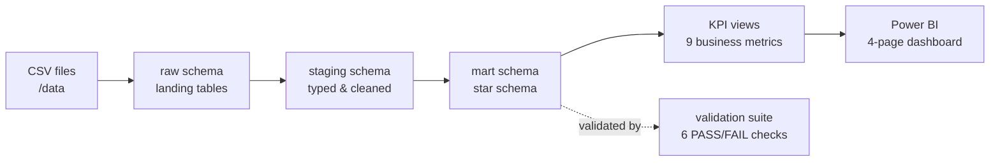
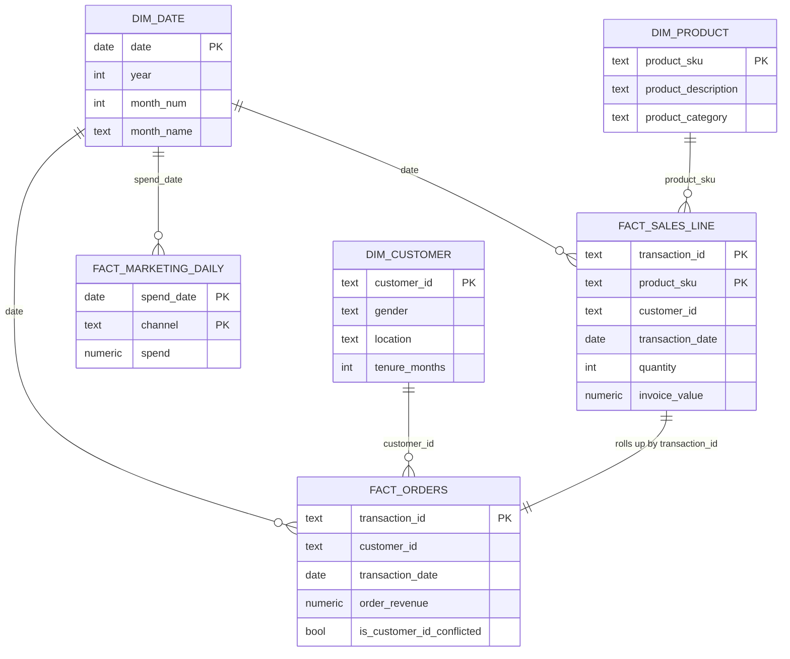

# Customer Retention & Revenue Sustainability Analysis  
### Production-Style SQL Analytics Pipeline (PostgreSQL + Power BI)



> A layered PostgreSQL pipeline (raw → staging → mart) on a real Kaggle e-commerce dataset, with a star-schema mart, nine analytical KPI views, a SQL validation suite that makes every figure auditable, and a four-page executive Power BI dashboard.

---

## 1. Business Problem

E-commerce companies must balance **customer acquisition and retention** to achieve sustainable revenue growth.

While acquisition drives short-term revenue spikes, long-term profitability depends on:

- Customer retention  
- Repeat purchase behavior  
- Sustainable lifetime value  
- Efficient marketing spend  

This project analyzes customer behavior using a production-style SQL architecture to answer:

- How much revenue comes from new vs existing customers?
- How strong is early and lifecycle retention?
- How do cohorts behave over time?
- Is marketing spend economically efficient?
- Is revenue concentrated among high-frequency buyers?

The objective is to simulate how analytics systems are built in real production environments — not just create dashboards.


## 2. Architecture Overview

The project follows a layered data architecture using PostgreSQL.



### Raw Layer (`raw` schema)
- Exact copy of source CSV/Excel files
- No transformations applied
- Full traceability to source data

### Staging Layer (`staging` schema)
- Data type normalization
- Date parsing (MM/DD/YYYY → DATE)
- Text cleaning and trimming
- GST percentage normalization
- Discount percentage normalization
- Month number standardization for joins

### Mart Layer (`mart` schema)
Dimensional star schema designed for analytical consumption.

#### Dimensions
- `dim_date`
- `dim_customer`
- `dim_product`

#### Fact Tables
- `fact_sales_line`
  - Grain: 1 row = 1 SKU within a transaction
  - Invoice value computed at line level
  - Explicit numeric precision (`numeric(18,2)`)

- `fact_orders`
  - Grain: 1 row = 1 transaction_id
  - Aggregated from line-level fact
  - Deterministic revenue rollups
  - Includes `is_customer_id_conflicted` flag for data integrity handling

- `fact_marketing_daily`
  - Grain: 1 row = 1 day per channel (Online/Offline)
  - Long-format marketing spend (`spend` + `channel`)
  - Explicit numeric precision (`numeric(18,2)`)

### KPI Layer (SQL Views)

Business-facing views built on top of mart tables.  
All KPI logic is centralized in SQL to ensure consistency and avoid duplication in Power BI.

- `vw_exec_kpis`
- `vw_monthly_revenue_new_vs_existing`
- `vw_cohort_retention`
- `vw_cohort_retention_rates`
- `vw_month1_retention_trend`
- `vw_month1_retention_summary`
- `vw_monthly_marketing_efficiency`
- `vw_marketing_summary`
- `vw_customer_lifetime_stats`
- `vw_customer_order_buckets`
- `vw_customer_repeat_summary`
- `vw_repeat_revenue_split`
- `vw_repeat_revenue_summary`
- `vw_customer_avg_orders`

### Star Schema (Mart Layer)



A full column-level reference for every table and view lives in [`docs/data_dictionary.md`](docs/data_dictionary.md).


## 3. Dataset Description

Source: Kaggle  
[Marketing Insights for E-Commerce Company](https://www.kaggle.com/datasets/rishikumarrajvansh/marketing-insights-for-e-commerce-company/data)

Transaction period:  
**2019-01-01 to 2019-12-31**

Dataset scale:

- 52,924 line items  
- 25,061 distinct transactions  
- 1,468 distinct customers  
- 20 product categories  
- 365 marketing spend records  


## 4. Data Grain & Modeling Decisions

Primary fact table:

> 1 row = 1 product SKU within a transaction

Secondary aggregation:

> 1 row = 1 transaction_id

Marketing spend modeling:

> 1 row = 1 day per channel (Online/Offline)

This ensures:

- No revenue double counting  
- Product-level flexibility  
- Correct order-level rollups  
- Clean monthly efficiency calculations  
- Scalable dimensional modeling  


## 5. Invoice Value Logic (Centralized in SQL)

Invoice value is calculated at the line-item level:

`Invoice Value = ((Quantity × Avg_Price) × (1 - Discount_pct) × (1 + GST)) + Delivery_Charges`

Business rules enforced:

- Discounts apply only when coupon status indicates usage  
- GST applied at product category level  
- Explicit numeric precision (`numeric(18,2)`)  
- Null-safe deterministic calculations  

Total Revenue:

**4,877,837.47**


## 6. Data Quality Handling

A data integrity issue was identified:

Some `transaction_id` values mapped to multiple `customer_id`s.

Resolution:

- Deterministic rule: `MIN(customer_id)`
- Flag added: `is_customer_id_conflicted`
- Behavioral KPIs exclude conflicted transactions

Conflict distribution:

- `TRUE`: 1,319  
- `FALSE`: 23,742  

This mirrors real-world production issue handling.


## 6.5 Validation Layer

The pipeline ships with a standalone SQL validation suite (`sql/06_validation_queries.sql`) that turns the dataset into something auditable, not just visualized. Each block returns a `check_status` column with a `PASS` / `FAIL` verdict, so the suite can be re-run after any change to the data or logic.

| # | Check | What it verifies |
|---|---|---|
| 1 | Row-count parity (raw → staging) | No rows are silently lost or duplicated during the staging build. |
| 2 | Sales-line ↔ orders reconciliation | For every transaction, `SUM(invoice_value)` from `fact_sales_line` equals `order_revenue` in `fact_orders` — the order grain rolls up cleanly from the line grain. |
| 3 | Fact referential integrity | Every `customer_id`, `product_sku`, and date in the fact tables resolves to its dimension. Conflicted transactions (multi-customer rows) are correctly excluded. |
| 4 | NULLs and primary-key uniqueness | No NULLs in keys; composite PKs `(transaction_id, product_sku)` and `(spend_date, channel)` are unique. |
| 5 | Invoice and quantity sanity | No negative revenue, no zero/negative quantities, `discount_rate_applied ∈ [0, 1]`, no negative marketing spend. |
| 6 | Marketing-daily completeness | Every `spend_date` has exactly two rows (one `Online`, one `Offline`). No unexpected channel values. |

The intent is to make the dataset auditable: a stakeholder can rerun the suite at any time and confirm the numbers in the dashboard reconcile from the underlying fact tables.


## 7. Key Findings

### 1️⃣ Marketing Efficiency

- Overall ROAS: **2.51**
- Marketing spend consistently generates >2x revenue
- Efficiency is stable with moderate volatility

### 2️⃣ Retention Behavior

- Month 1 retention improved modestly in the second half (+8% relative lift)
- Lifecycle retention stabilizes after early drop
- Retention improvement is incremental, not transformational

### 3️⃣ Customer Value & Revenue Concentration

- **93% of customers are repeat buyers**
- **99.61% of revenue comes from repeat buyers**
- Average orders per customer: **17.74**
- 28.9% of customers (21+ orders) generate ~69% of revenue

This indicates a **loyalty-core driven model** with strong revenue concentration among high-frequency buyers.


## 8. Important Dataset Note

The dataset shows unusually high repeat behavior:

- 93% repeat customers  
- 99.6% revenue from repeat buyers  
- 17.74 average orders per customer  

This is atypical for standard e-commerce and may reflect:

- High-frequency retail characteristics  
- Subscription-like behavior  
- Synthetic dataset structure  

This context is important when interpreting retention metrics.


## 9. Dashboard Structure (MVP)

### Executive Summary
- Revenue, Orders, Customers, AOV
- New vs Existing Revenue Trend
- Month 1 Retention Trend

### Marketing Efficiency
- Overall ROAS
- ROAS Trend
- Revenue vs Marketing Spend

### Cohort Analysis
- Month 1 Retention Comparison (First vs Second Half)
- Cohort Heatmap (Months 1–6)
- Lifecycle Retention Curve

### Customer Value & Concentration
- % Repeat Customers
- % Revenue from Repeat Buyers
- Orders per Customer Distribution
- Revenue Concentration by Order Bucket


## 10. Design Principles

- Clear separation of layers  
- Explicit grain declaration  
- Deterministic revenue logic  
- Centralized KPI definitions  
- Weighted metric correctness  
- Minimal BI-layer computation  
- Production-aware modeling  

The goal is to demonstrate systems thinking and metric integrity.


## 11. Tools Used

- PostgreSQL 18  
- pgAdmin 4  
- Power BI Desktop  
- GitHub  


## 12. Project Status

✅ Raw ingestion completed  
✅ Staging layer implemented  
✅ Mart star schema implemented  
✅ Marketing fact modeled  
✅ KPI views implemented  
✅ 4 analytical dashboard pages completed  
✅ SQL validation suite (PASS/FAIL reconciliation checks)  
✅ Column-level data dictionary  


## 13. How to Reproduce

```text
git clone https://github.com/EstebanSP23/ecommerce_retention_analytics
cd ecommerce_retention_analytics
```

Then in PostgreSQL, run the SQL scripts in order:

```bash
psql -d ecommerce_retention_analytics -f sql/01_create_schemas.sql
psql -d ecommerce_retention_analytics -f sql/02_raw_tables.sql
psql -d ecommerce_retention_analytics -f sql/00_load_csvs.sql      # \COPY from /data
psql -d ecommerce_retention_analytics -f sql/03_staging_tables.sql
psql -d ecommerce_retention_analytics -f sql/04_mart_tables.sql
psql -d ecommerce_retention_analytics -f sql/05_kpi_views.sql
psql -d ecommerce_retention_analytics -f sql/06_validation_queries.sql   # expect every check to PASS
```

> **Using pgAdmin instead of psql?** `\COPY` is psql-only, so `00_load_csvs.sql` ships with a pgAdmin-compatible `COPY` block (commented out) that uses absolute paths. Comment the psql block and uncomment the pgAdmin block to load the data through the Query Tool.

Then open `dashboard/market_insights.pbix` in Power BI Desktop and refresh against the mart layer.


## 14. Future Enhancements

- Predictive CLV modeling  
- Churn probability modeling  
- Marketing attribution modeling  
- Performance indexing simulation  


*Project by [EstebanSP23](https://github.com/EstebanSP23) – Production-oriented Data Analytics Portfolio*
